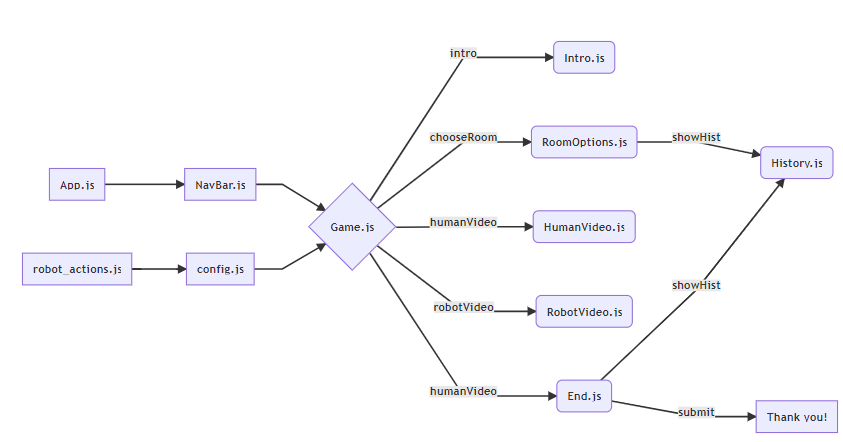
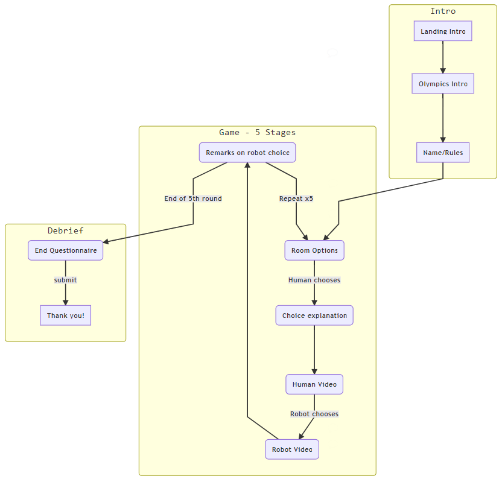

# HRI Game - Robot Olympics

Created by Matthew Tang. Questions? Email me at matthewtang@berkeley.edu.

## Technologies used
* Frontend: ReactJS (https://matthew29tang.github.io/hri-game/)
    * Theme: Material UI
    * Deployment: Github pages
* Backend: NodeJS
    * Deployment: Heroku (https://hri-game-backend.herokuapp.com)

## Frontend

Class Heirarchy Structure:



Game Structure Flow:



Robot actions are stored offline from the Monte Carlo Tree Search in a JSON format.

### Features
* Local storage (cookies) to store progress if site is closed
* Random robot strategies for multiple treatments (Starting from versions 1.4+, even IDs=optimal, odd IDs=random)
* Continue buttons only show up once videos finish playing to force users to watch all of video (on first time playing)
* History of past room choices
* Questions along the way and end questionnaire 
* Data is pushed to a google spreadsheet every step of the way.

### Config
* Room diagrams can be updated in `/src/img`. Rewards,  abilities, and video URLs can be changed in `/src/config.js`.
* Robot strategies are stored offline in JSON files. You can add more robot strategies in the form `robot_actions#.js`.
* Import the new strategies to `config.js` and add it to the array of strategies. Denise will randomly choose between the strategies.
* Currently, strategy 0 is optimal (from mcts), strategy 1 is random (placebo).
* To export more data from the site, make sure the state variable in game is added to the JSON payload that is sent to the google spreadsheet.
    * Make sure the google spreadsheet has a column that matches the key in the JSON.

## Backend
The frontend sends data to the backend to store in a google sheet using google sheets API. I used the Google-Spreadsheet Node package for this which can be found [here](https://www.npmjs.com/package/google-spreadsheet).

Data is stored in [this](https://docs.google.com/spreadsheets/d/1aVNGZKTV20RuaPTpeTE8UQ0p_gevxrxDKdD0-2HUS5U/edit#gid=0) spreadsheet.

## Backend Endpoints
Server accepts only POST requests. Do not send arrays as parameters or the backend will be unable to parse them.

### raw
Stores data progress in "raw" sheet to avoid losing partial responses.
###### Endpoint
```
https://hri-game-backend.herokuapp.com/raw
```
###### Body
- **<code>JSON</code> payload** — JSON containing data to store in spreadsheet. See example below.
- Content-Type: `application/x-www-form-urlencoded`

###### Return Format
- None

###### Example Body
```
{ 
    Name: 'Name',
    ID: 22496,
    FirstTime: true,
    Date: '7-30-2019 14:3:12',
    History: '1_2',
    TotalScore: '3.0',
    H0: 'Response here',
    R0: 'Response here',
    ...
    SiteVersion: 1.4
}
```

---

### complete
Stores data progress in "complete" sheet to avoid losing partial responses. Similar body/return as above
###### Endpoint
```
https://hri-game-backend.herokuapp.com/complete
```

###### Example Body
```
{ 
    Name: 'Name',
    ID: 22496,
    FirstTime: true,
    Date: '7-30-2019 14:3:12',
    History: '1_2',
    TotalScore: '3.0',
    H0: 'Response here',
    R0: 'Response here',
    ...
    D1: 'Debrief'
    ...
    A1: 'Slider1'
    ..
    SiteVersion: 1.1
}
```

---

### Google Sheets API
I have a google cloud service account linked to the output spreadsheet (hri-game-admin@hri-game.iam.gserviceaccount.com). Please contact me (matthewtang@berkeley.edu) if you need these credentials. Credentials must be placed in the `credentials.json` file in the root folder of the server. Credentials should never be stored on github for security concerns.

Google sheets API is free so there is no practical concern for call rate-limiting.

The backend currently runs on a Heroku server using a free web dyno using my free credits. It doesn't need to run 24/7 which means I can maintain it easily without incurring charges (it can idle when nobody is using the site since data storage calls are asynchronous).

